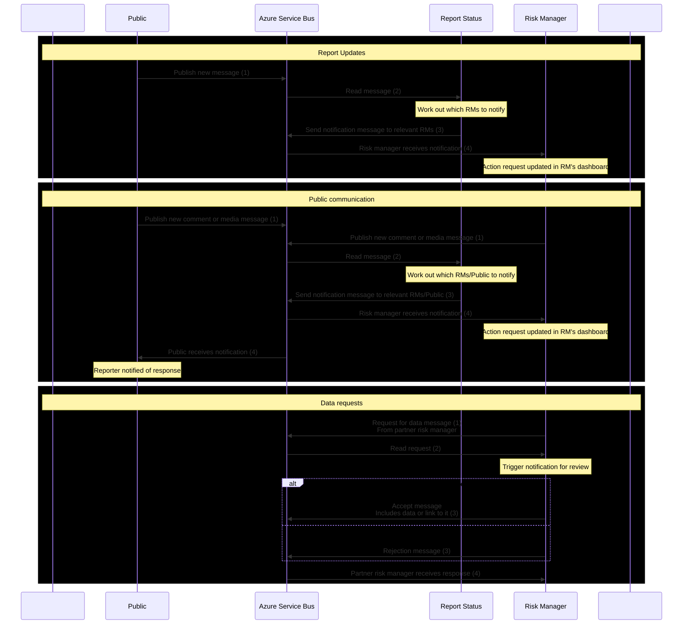

```mermaid
sequenceDiagram
    participant L as 
    participant Public
    participant ASB as Azure Service Bus
    participant RS as Report Status
    participant RM as Risk Manager
    participant R as 

    rect rgb(0, 0, 0)
        Note over L,R: Report Updates
        Public->>ASB: Publish new message (1)
        ASB->>RS: Read message (2)
        Note over RS: Work out which RMs to notify
        RS->>ASB: Send notification message to relevant RMs (3)
        ASB->>RM: Risk manager receives notification (4)
        Note over RM: Action request updated in RM's dashboard
    end

    rect rgb(0, 0, 0)
        Note over L,R: Public communication
        Public->>ASB: Publish new comment or media message (1)
        RM->>ASB: Publish new comment or media message (1)
        ASB->>RS: Read message (2)
        Note over RS: Work out which RMs/Public to notify
        RS->>ASB: Send notification message to relevant RMs/Public (3)
        ASB->>RM: Risk manager receives notification (4)
        Note over RM: Action request updated in RM's dashboard
        ASB->>Public: Public receives notification (4)
        Note over Public: Reporter notified of response
    end

    rect rgb(0, 0, 0)
        Note over L,R: Data requests
        RM->>ASB: Request for data message (1)<br>From partner risk manager
        ASB->>RM: Read request (2)
        Note over RM: Trigger notification for review
        alt Data request review - Accept
            RM->>ASB: Accept message<br>Includes data or link to it (3)
        else Data request review - Reject
            RM->>ASB: Rejection message (3)
        end
        ASB->>RM: Partner risk manager receives response (4)
    end
```